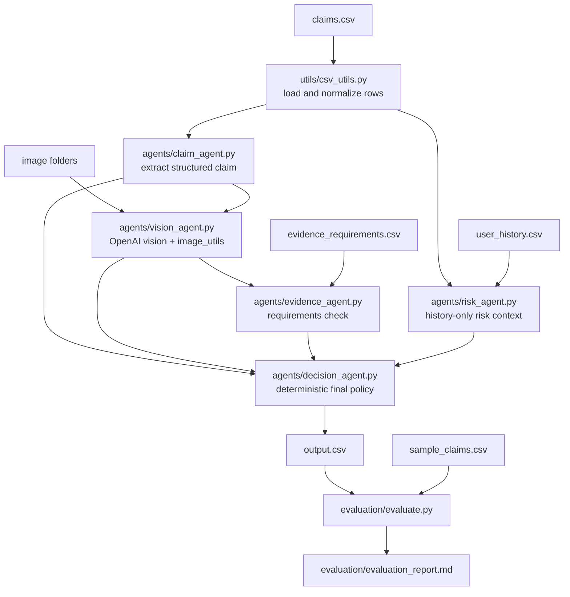

# Multimodal Damage Claim Verification System

A production-oriented Python pipeline for verifying damage claims using structured claim extraction, OpenAI vision analysis, evidence requirement checks, user-history risk context, and deterministic final decisions.

The project is optimized for hackathon delivery: clear agent boundaries, low-cost model usage, resumable batch processing, deterministic policy logic, and an evaluation script for fast iteration.

## What the system does

Given:

- `claims.csv`
- `sample_claims.csv`
- `user_history.csv`
- `evidence_requirements.csv`
- local image folders containing claim evidence

The system produces:

- `output.csv`

For every claim, it:

1. Extracts the actual damage claim from the conversation.
2. Analyzes uploaded image evidence.
3. Checks whether the image evidence matches or contradicts the claim.
4. Verifies minimum evidence requirements.
5. Adds user-history risk context.
6. Produces one final status:
   - `supported`
   - `contradicted`
   - `not_enough_information`

Supported claim objects:

- `car`
- `laptop`
- `package`

## Architecture



## Project structure

```text
.
├── agents/
│   ├── claim_agent.py        # Extracts claim details from conversation text
│   ├── vision_agent.py       # Analyzes image evidence with OpenAI vision
│   ├── evidence_agent.py     # Checks evidence_requirements.csv
│   ├── risk_agent.py         # Adds user-history risk context
│   └── decision_agent.py     # Final deterministic decision logic
├── models/
│   └── schemas.py            # Pydantic models and enums
├── utils/
│   ├── csv_utils.py          # CSV parsing, output serialization, resume helpers
│   └── image_utils.py        # Pillow validation/preprocessing
├── evaluation/
│   ├── evaluate.py           # Evaluation script
│   └── evaluation_report.md  # Report template / generated report target
├── main.py                   # Batch pipeline entry point
├── requirements.txt          # Python dependencies
└── README.md
```

## Setup

Use Python 3.11 or newer.

### Windows PowerShell

```powershell
python -m venv .venv
.\.venv\Scripts\Activate.ps1
pip install -r requirements.txt
```

### macOS / Linux

```bash
python -m venv .venv
source .venv/bin/activate
pip install -r requirements.txt
```

## Environment variables

Required:

```bash
OPENAI_API_KEY=your_api_key_here
```

Optional:

```bash
OPENAI_CLAIM_MODEL=gpt-4.1-mini
OPENAI_VISION_MODEL=gpt-4.1-mini
```

The defaults are selected for a hackathon-friendly balance of cost, latency, and quality. Before final production deployment, verify current model availability and pricing in the official OpenAI pricing and model documentation.

## Input files

### `claims.csv`

Expected columns:

- `user_id`
- `user_claim`
- `claim_object`
- `image_paths`

`image_paths` may be a JSON list, Python-style list, comma-separated list, pipe-separated list, semicolon-separated list, or a single path.

Example:

```csv
user_id,user_claim,claim_object,image_paths
u123,"My laptop screen cracked after delivery",laptop,"images/u123_1.jpg"
```

### `evidence_requirements.csv`

Required columns:

- `claim_object`
- `applies_to`

Recommended columns:

- `requirement_id`
- `requirement_type`
- `minimum_images`
- `evidence_requirement`

Recognized requirement types include:

- `valid_image`
- `correct_object`
- `damage_visible`
- `claimed_issue_visible`
- `claimed_part_visible`
- `acceptable_quality`
- `minimum_images`
- `no_manipulation`

### `user_history.csv`

The risk agent supports common history columns such as user ID, past claim status, claim date, rejection rate, claim count, recent claim count, and suspicious history flags. Missing history is handled safely and does not block a decision.

## Run the pipeline

With default file names in the project root:

```bash
python main.py
```

With explicit paths:

```bash
python main.py \
  --claims claims.csv \
  --user-history user_history.csv \
  --evidence-requirements evidence_requirements.csv \
  --output output.csv \
  --images-dir images
```

Useful options:

- `--batch-size 10` controls checkpoint frequency.
- `--workers 1` controls parallel row processing.
- `--agent-attempts 2` controls application-level retries.
- `--sdk-retries 2` controls OpenAI SDK retries.
- `--no-resume` ignores existing `output.csv` and recomputes all rows.
- `--claim-model` overrides the claim extraction model.
- `--vision-model` overrides the vision model.

Resume is enabled by default. If the run stops midway, run the same command again and already completed rows in `output.csv` will be skipped.

## Output format

`output.csv` contains exactly these columns:

| Column | Meaning |
|---|---|
| `user_id` | User identifier from the input claim |
| `image_paths` | Original image path list serialized as JSON |
| `user_claim` | Original conversation/claim text |
| `claim_object` | Claimed object: `car`, `laptop`, `package`, or `unknown` |
| `evidence_standard_met` | Boolean evidence requirement result |
| `evidence_standard_met_reason` | Concise image-grounded explanation |
| `risk_flags` | JSON list of user-history risk flags |
| `issue_type` | Normalized issue type enum |
| `object_part` | Object part involved, or `unknown` |
| `claim_status` | `supported`, `contradicted`, or `not_enough_information` |
| `claim_status_justification` | Final decision explanation |
| `supporting_image_ids` | JSON list of image IDs supporting the final decision |
| `valid_image` | Whether at least one useful image was available |
| `severity` | `none`, `low`, `medium`, `high`, or `unknown` |

Allowed `issue_type` values:

- `dent`
- `scratch`
- `crack`
- `glass_shatter`
- `broken_part`
- `missing_part`
- `torn_packaging`
- `crushed_packaging`
- `water_damage`
- `stain`
- `none`
- `unknown`

## Evaluation

Run:

```bash
python evaluation/evaluate.py --labels sample_claims.csv --predictions output.csv
```

Optional explicit report path:

```bash
python evaluation/evaluate.py \
  --labels sample_claims.csv \
  --predictions output.csv \
  --report evaluation/evaluation_report.md
```

The evaluator reports:

- claim status accuracy
- issue type accuracy
- object part accuracy
- severity accuracy
- error analysis
- common failure modes
- improvement recommendations

## Decision policy

The final decision agent follows a strict hierarchy:

1. Images are the primary source of truth.
2. User history never overrides clear image evidence.
3. Evidence requirements must be satisfied for a `supported` decision.

High-level rules:

- `supported`: the claim matches visible damage and evidence is sufficient.
- `contradicted`: the relevant object/part is visible and the claimed damage is absent or contradicted.
- `not_enough_information`: evidence is insufficient, image quality is poor, angle is wrong, object/part is not visible, or the image set is otherwise inconclusive.

## Operational analysis

### Approximate model calls

For a successful row:

- Claim extraction: 1 text structured-output call.
- Vision analysis: 1 multimodal structured-output call for up to 8 images.
- Evidence, risk, and final decision: deterministic Python logic with no model call.

Approximate total:

```text
model_calls ≈ number_of_claims * 2
```

Retries can increase this:

```text
worst_case_agent_calls ≈ number_of_claims * 2 * agent_attempts
```

The OpenAI SDK may also retry transient HTTP failures based on `--sdk-retries`.

### Token and image estimates

These are planning estimates, not billing guarantees:

```text
claim_text_tokens ≈ claims * (1,500 input + 250 output)
vision_text_tokens ≈ claims * (3,000 input + 600 output)
image_count = total image paths across claims, capped at 8 images per claim
```

Image processing cost depends on the selected OpenAI model, image dimensions, and image detail setting. This project resizes images before upload to reduce unnecessary cost.

### Cost estimate formula

Because model pricing changes over time, keep pricing as configurable assumptions:

```text
estimated_cost =
  (input_tokens / 1,000,000 * input_price_per_1m_tokens)
  + (output_tokens / 1,000,000 * output_price_per_1m_tokens)
  + image_processing_cost
```

Before submission or deployment, verify the current official OpenAI pricing page and fill the values into `evaluation/evaluation_report.md`.

### Latency estimates

Typical hackathon planning range:

- Claim extraction: 1–3 seconds per claim.
- Vision analysis: 4–12 seconds per claim depending on image count, image size, model, and network.
- Deterministic checks: usually under 100 ms.

Sequential throughput is roughly:

```text
5–15 seconds per claim
```

Parallel throughput improves with `--workers`, but must stay within API rate limits.

### Batching strategy

The pipeline uses logical CSV batches, not the OpenAI Batch API:

- Default batch size: 10 rows.
- Output is checkpointed after each batch.
- Resume is enabled by default.
- Failed rows are converted into safe `not_enough_information` outputs instead of stopping the full run.

### Retry strategy

- Application-level retry wraps the claim and vision agents.
- SDK-level retry handles transient OpenAI API failures.
- Backoff uses jitter to reduce retry spikes.
- Row-level exception handling preserves batch progress.

### Rate-limit considerations

For hackathon runs:

- Start with `--workers 1`.
- Increase to `--workers 2` or `--workers 3` only after confirming stable rate-limit behavior.
- Reduce image size/detail if vision calls become slow or expensive.
- Use resume to avoid paying again for completed rows.
- If rate limits are frequent, lower concurrency and retry settings.

## Assumptions

- Images are local JPEG, PNG, or WEBP files.
- Damage must be visually evident to be considered supported.
- User history is useful context only and does not determine truth.
- Evidence requirement text is interpreted conservatively.
- The final output schema is fixed by the hackathon requirements.

## Limitations

- The system cannot verify hidden/internal damage that is not visible in images.
- Subtle scratches, small cracks, reflections, glare, or manipulation may be missed.
- Natural-language evidence requirements outside recognized types are treated conservatively.
- Model behavior and pricing should be rechecked against current OpenAI documentation before production use.
- This project is designed for claim triage and verification support, not final legal or insurance adjudication.

## Final submission checklist

- Place the input CSV files in the project root or pass custom paths.
- Set `OPENAI_API_KEY`.
- Run `python main.py`.
- Confirm `output.csv` has all required columns.
- Run `python evaluation/evaluate.py --labels sample_claims.csv --predictions output.csv`.
- Review `evaluation/evaluation_report.md`.
- Submit the source code, README, requirements, and generated output/report files.
